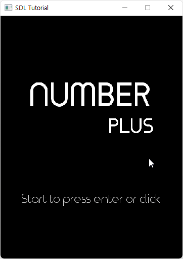
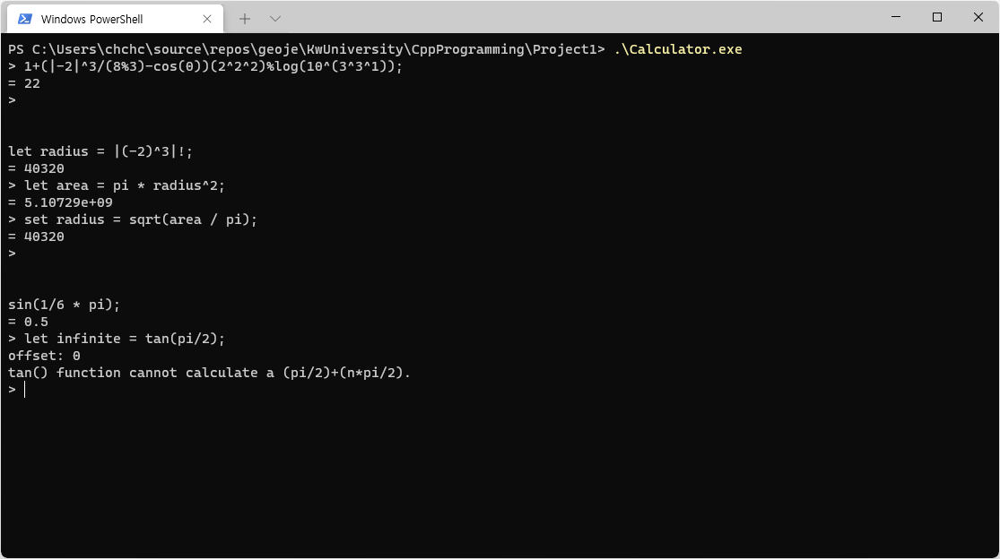
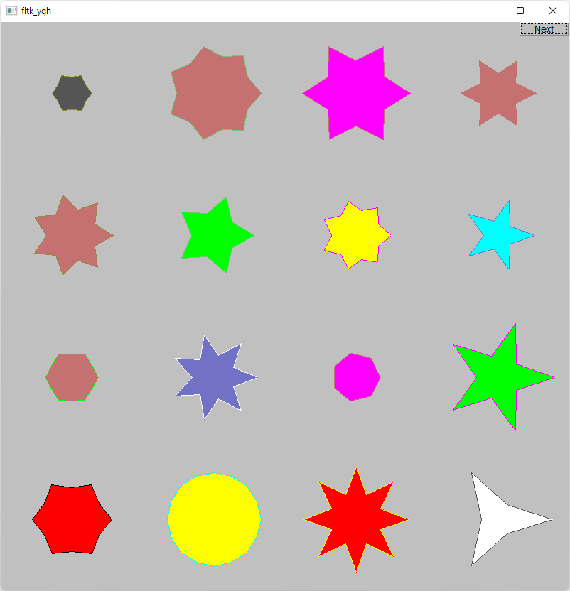
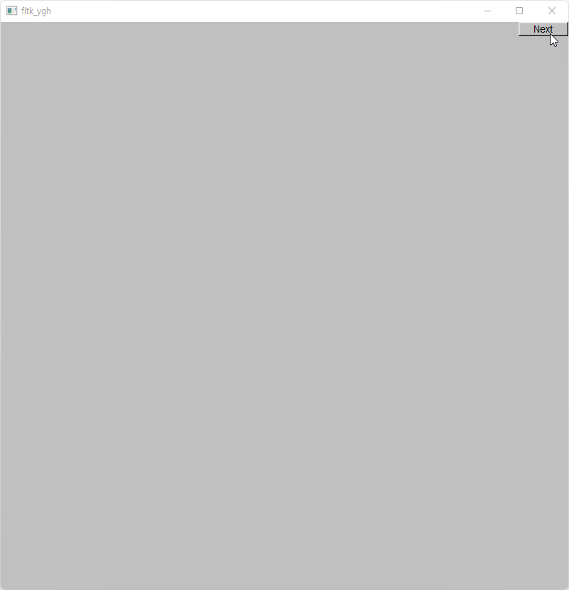
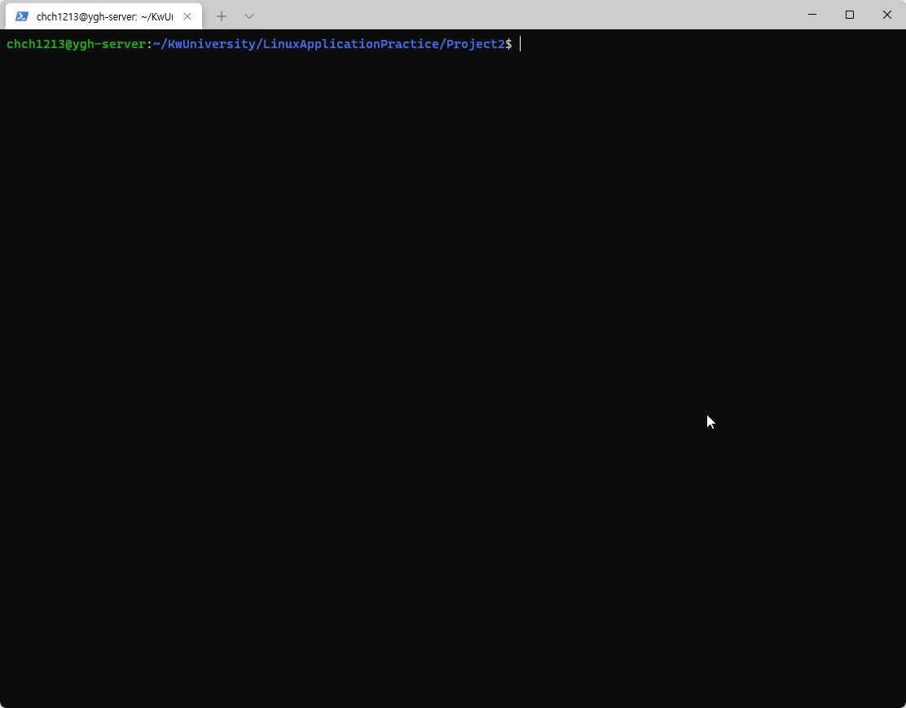

# 🎠 나의 대학 광운대에서...
**2017년 3월 입학** 후 **2023년 2월 졸업**까지 직접 만들었던 프로젝트들이 담겨져있습니다.

> #### Copyright
> 문제가 생길까봐 학교에서 제공받은 과제 내용 같은 경우에는 암호화 압축을 통하여 비공개 처리하였습니다.

<br><br><br><br>

# 🔢 Number Plus [다운로드](https://github.com/geoje/KwUniversity/raw/master/CProgrammingAdvanced/FinalProject/NumberPlus.zip)
#### 1학년 2학기 C프로그래밍 (2017-11-28 ~ 2017-12-20)
`C` 언어의 `SDL` 라이브러리를 사용하여 만든 간단한 게임입니다.
`2x2` 사이즈 부터 `5x5` 사이즈까지 난이도를 선택할 수 있고 그 크기에 랜덤한 숫자가 순서대로 배열되게 되는데 제한시간동안 숫자를 순차적으로 최대한 빠르게 클릭하면 됩니다.


<br><br><br><br>

# 🧮 Caculator [다운로드](https://github.com/geoje/KwUniversity/raw/master/CppProgramming/Project1/Calculator.exe)
#### 2학년 1학기 고급프로그래밍 (2018-04-05 ~ 2018-04-22)
`Command Line`에서 **수식을 계산**해주는 프로그램 입니다.
재귀함수의 효과를 제대로 느낄 수 있었고 나중에 `Backtracking` 알고리즘 기술을 배울 때 발판이 되었습니다.


<br><br><br><br>

# ⭐ Shapes [다운로드](https://github.com/geoje/KwUniversity/raw/master/CppProgramming/Project2/Shapes.exe)
#### 2학년 1학기 고급프로그래밍 (2018-05-10 ~ 2018-05-27)
`C++` 에서 `GUI` 프로그래밍을 도와주는 `FLTK` 라이브러리를 사용해 만든 **랜덤 도형 표시 프로그램**입니다.


<br><br><br><br>

# 👮‍♂️ Characters [다운로드](https://github.com/geoje/KwUniversity/raw/master/CppProgramming/Project2/Characters.exe)
#### 2학년 1학기 고급프로그래밍 (2018-05-10 ~ 2018-05-27)
`C++` 에서 `GUI` 프로그래밍을 도와주는 `FLTK` 라이브러리를 사용해 만든 **추격자와 도망자 프로그램**입니다.


<br><br><br><br>

# 📁 FileExplorer [다운로드](https://github.com/geoje/KwUniversity/blob/master/LinuxApplicationPractice/Project2/2017203014_YGH.sh)
#### 2학년 1학기 리눅스활용실습 (2018-04-25 ~ 2018-06-18)
`Bash Shell` 스크립트 이며 리눅스 `Ubuntu` 운영체제에서 작성되었고 `CLI` 환경으로 사용할 수 있는 **파일탐색기** 입니다.

> #### 바로 실행 스크립트
> 아래 명령어를 bash 쉘에서 입력하시면 바로 실행해보실 수 있으며 종료는 `Ctrl + C` 입니다.
``` bash
curl https://raw.githubusercontent.com/geoje/KwUniversity/master/LinuxApplicationPractice/Project2/2017203014_YGH.sh > FileExplorer.sh && . FileExplorer.sh
```


<br><br><br><br>

# 📊 ScoreChart [다운로드](https://github.com/geoje/KwUniversity/raw/master/ObjectOrientedProgramming\hw5\ScoreChart.exe)
#### 2학년 2학기 고급프로그래밍 (2018-05-10 ~ 2018-05-27)
`JavaFX`를 기반하여 `GUI` 로 만들어진 점수 입력 후 **그래프 통계**를 볼 수 있는 프로그램입니다.


<br><br><br><br>